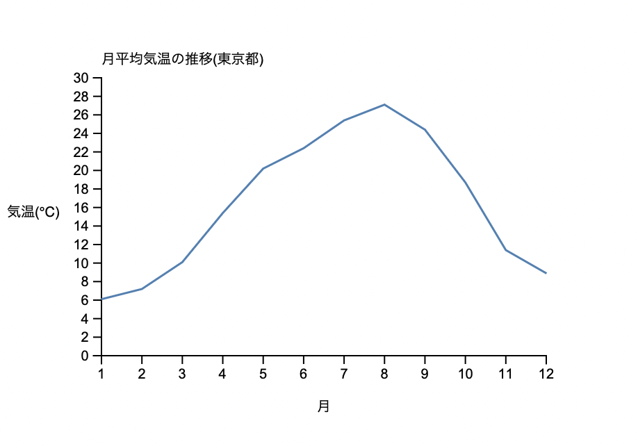

©︎ 2022 OnukiTomoya  

作成：2022/1/15  
更新：2022/1/19  


# D3.js + TypeScriptによる可視化サンプル

## サンプル集

### a. 時刻データ
1. [折れ線グラフ / Line Chart](https://github.com/tomoya-onuki/D3_and_TypeScript_sample/tree/a1_LineChart)
1. [折れ線グラフ / Line Chart (Small Multiples)](https://github.com/tomoya-onuki/D3_and_TypeScript_sample/tree/a2_LineChart)
1. [折れ線グラフ / Line Chart (Superposition)](https://github.com/tomoya-onuki/D3_and_TypeScript_sample/tree/a3_LineChart)
1. [面グラフ / Area Chart](https://github.com/tomoya-onuki/D3_and_TypeScript_sample/tree/a4_AreaChart)
1. [積み上げ面グラフ / Stacked Area Chart](https://github.com/tomoya-onuki/D3_and_TypeScript_sample/tree/a5_StackedAreaChart)
1. [Stream Graph](https://github.com/tomoya-onuki/D3_and_TypeScript_sample/blob/a6_StreamGraph/readme.md)
1. [Theme River](https://github.com/tomoya-onuki/D3_and_TypeScript_sample/tree/a7_ThemeRiver)
1. [Horizon Graph](https://github.com/tomoya-onuki/D3_and_TypeScript_sample/tree/a8_HorizonGraph)
1. Blaided Graph
1. Two-Tone Pseudo Coloring


### b. 多変量量的データ 
1. 散布図 / Scatter Plot
1. パネル行列 / Panel Matrix
1. 散布図行列 / Scatter Plot Matrix
1. Bubble Chart
1. Radar Chart
1. Parallel Coordinates
1. Parallel Sets
1. Mosaic Plot

### c. 多変量質的データ
1. 棒グラフ / Bar Chart
1. 円グラフ / Pie Chart
1. Staked Bar Chart
1. Heat Map (Tile Map)
1. Tile Map (Small Multiples)

### d. 階層データ
1. Tree Map
1. Dendrogram
1. Icicle diagram
1. Sunburst diagram

### e. 地理データ
1. コロプレス地図 / choropleth map
1. 計量記号図 / Graduated Symbol Map


### f. インタラクション
1. [Horizon Graph](https://github.com/tomoya-onuki/D3_and_TypeScript_sample/tree/f1_HorizonGraph)

### g. テキストデータ
1. [ワードクラウド](https://github.com/tomoya-onuki/D3_and_TypeScript_sample/tree/g1_WordCloud)


## Setup
1. package.jsonの作成
```
npm init -y
```
scriptの部分に以下を追加  
```
"build": "webpack",
"watch": "webpack -w"
```

2. モジュールのインストール
```
npm i -D webpack webpack-cli typescript ts-loader
npm install @types/d3 d3
```

1. tsconfig.jsonを作る
```
npx tsc --init
```
必要な行もコメントアウトされている可能性があるので注意
必要な行↓
```
{
  "compilerOptions": {
    "target": "ES2016",
    "module": "commonjs",
    "moduleResolution": "node",
    "strict": true
  }
}
```

5. webpack.config.jsをつくる
```
module.exports = {
    module.exports = {
    mode: "development",
  
    entry: "./src/main.ts",
  
    module: {
      rules: [
        {
          test: /\.ts$/,
          use: "ts-loader"
        }
      ]
    },

    resolve: {
      extensions: [".ts"]
    }
  };
```

6. コンパイル
```
npm run build
```
or
```
mac: Shift + Command + B
win: Shift + Control + B
```

7. 実行  
live serverでGoLiveし、index.htmlを開く  
以下のような折れ線グラフが表示されれば成功


