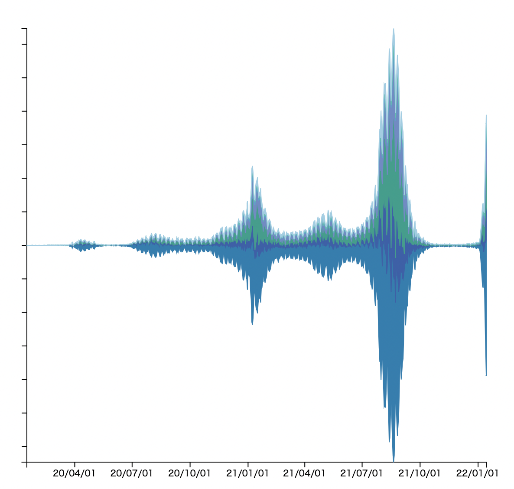

©︎ 2022 OnukiTomoya  

作成：2022/1/15  
更新：2022/1/15  

# D3.js + TypeScriptによる可視化サンプル

## 1f Stream Graph
- 新型コロナウイルスの**関東地方における新規陽性者数の日別推移データ**をStreamGraphで可視化する。
- 関東地方は東京都、埼玉県、神奈川県、千葉県、群馬県、栃木県、茨城県の7県とする。
- データ入手先: https://www.mhlw.go.jp/stf/covid-19/open-data.html
- 参考文献 : L. Byron and M. Wattenberg, Stacked Graphs Geometry & Aesthetics, IEEE TVCG, Vol. 14, No. 6, pp. 1245-1252, 2008.

