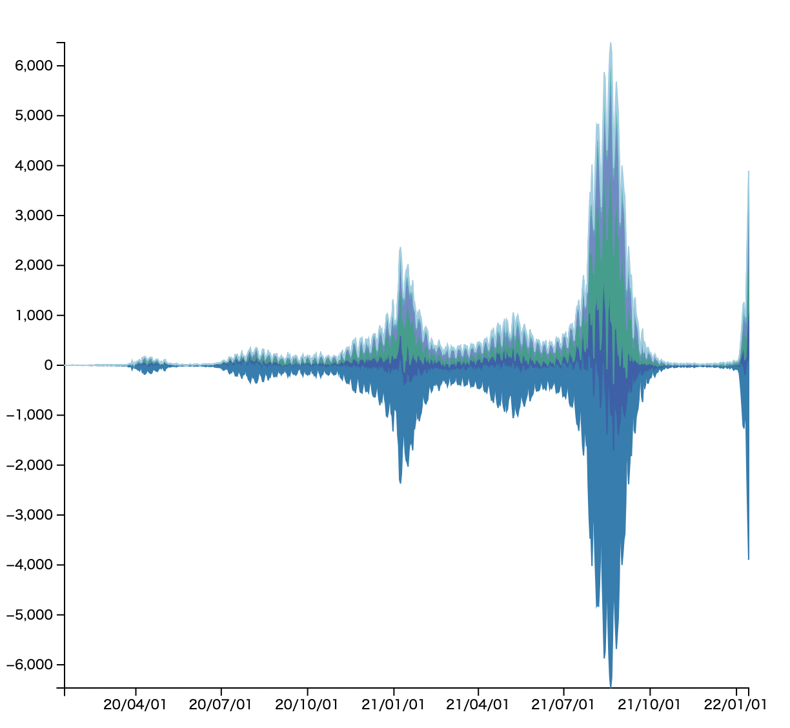

©︎ 2022 OnukiTomoya  

作成：2022/1/15  
更新：2022/1/15  

# D3.js + TypeScriptによる可視化サンプル

## 1g Theme River
- 新型コロナウイルスの**関東地方における新規陽性者数の日別推移データ**をTheme Riverで可視化する。
- 関東地方は東京都、埼玉県、神奈川県、千葉県、群馬県、栃木県、茨城県の7県とする。
- データ入手先: https://www.mhlw.go.jp/stf/covid-19/open-data.html
- 参考文献 : Havre, S., Hetzler, B., &#38; Nowell, L. (n.d.). ThemeRiver TM * : In Search of Trends, Patterns, and Relationships * Patent pending.

