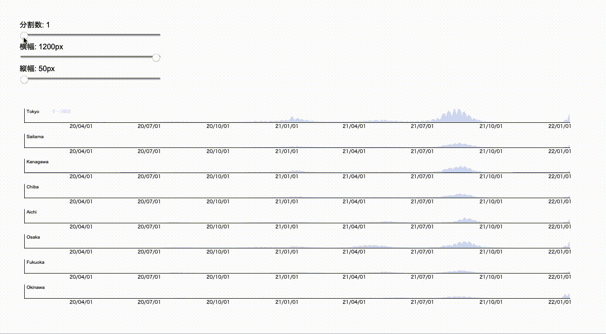

©︎ 2022 OnukiTomoya  

作成：2022/1/15  
更新：2022/1/18  

# D3.js + TypeScriptによる可視化サンプル

## f1　Horizon　Graph
- 新型コロナウイルスの**各県の新規陽性者数の日別推移データ**をHorizon GraphのSmall Multiplesで可視化する。
- HorizonGraphの分割数をインタラクティブに変更できるようにする。
- データ入手先: https://www.mhlw.go.jp/stf/covid-19/open-data.html

