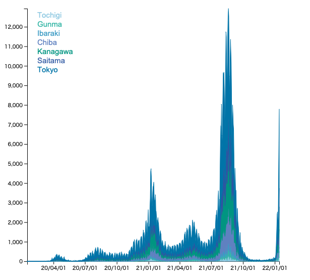

©︎ 2022 OnukiTomoya  

作成：2022/1/15  
更新：2022/1/19  

# D3.js + TypeScriptによる可視化サンプル

## a5 Stacked Area Chart
- 新型コロナウイルスの**関東地方における新規陽性者数の日別推移データ**を積み上げ面グラフで可視化する。
- 関東地方は東京都、埼玉県、神奈川県、千葉県、群馬県、栃木県、茨城県の7県とする。
- データ入手先: https://www.mhlw.go.jp/stf/covid-19/open-data.html

| Date      | ...    | Ibaraki  | Tochigi | Gunma | Saitama | Chiba | Tokyo | Kanagawa | ...  |
| :----:    | :----: | :----:   | :----:  | :----:| :----:  | :----:| :----:| :----:   | ---- |
| 2020/1/16 | ...    |  0       |   0     |  0    |  0      |  0    |  0    |  0       | ...  |
| 2020/1/17 | ...    |  0       |   0     |  0    |  0      |  0    |  0    |  0       | ...  |
| ...       | ...    | ...      | ...     | ...   | ...     | ...   | ...   | ...      | ...  |

