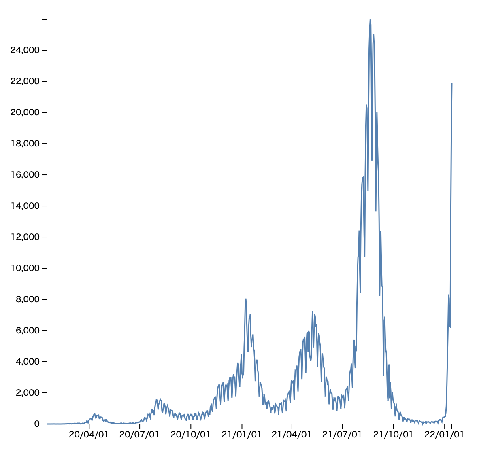

©︎ 2022 OnukiTomoya  

作成：2022/1/15  
更新：2022/1/15  

# D3.js + TypeScriptによる可視化サンプル

## a1 Line Chart
- 新型コロナウイルスの**全国における新規陽性者数の日別推移データ**を折れ線グラフで可視化する。
- データ入手先: https://www.mhlw.go.jp/stf/covid-19/open-data.html
- 全国のデータはALLの列

| Date      | ALL    | Hokkaido  | ... |
| :----:    | :----: | :----:    | ---- |
| 2020/1/16 |  1     |  0        | ... |
| 2020/1/17 |  0     |  0        | ... |
| ...       | ...    | ...       | ... |

