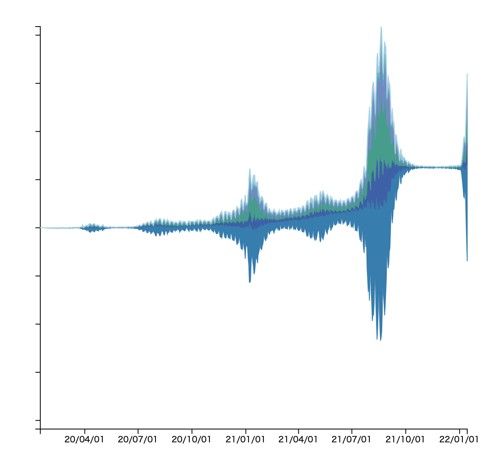

©︎ 2022 OnukiTomoya  

作成：2022/1/15  
更新：2022/1/19  

# D3.js + TypeScriptによる可視化サンプル

## a9 Braided Graph
- 新型コロナウイルスの**関東地方における新規陽性者数の日別推移データ**をBraided Graphで可視化する。
- 関東地方は東京都、埼玉県、神奈川県、千葉県、群馬県、栃木県、茨城県の7県とする。
- データ入手先: https://www.mhlw.go.jp/stf/covid-19/open-data.html
- 参考文献 : Javed, W., Mcdonnel, B., &#38; Elmqvist, N. (2010). <i>Graphical Perception of Multiple Time Series</i>.

