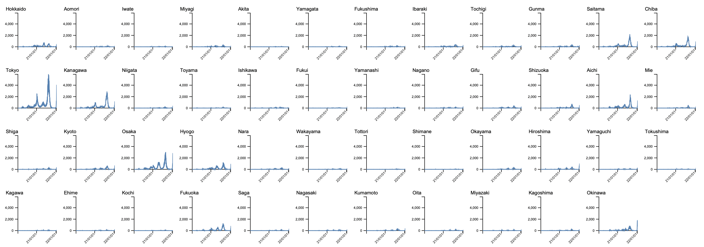

©︎ 2022 OnukiTomoya  

作成：2022/1/15  
更新：2022/1/15  

# D3.js + TypeScriptによる可視化サンプル

## 1b Line Chart (Small Multiples)
- 新型コロナウイルスの**都道府県ごとの新規陽性者数の日別推移データ**を可視化した折れ線グラフを**並べる**。
- データ入手先: https://www.mhlw.go.jp/stf/covid-19/open-data.html

